<div align="center">
  
</div>

<br/>

# 🎓 Maktabkhooneh Automated Downloader, Metadata Scraper & Auto-Enrollment

> **High-performance, concurrent, and resilient metadata scraper, size inspector, student reviews collector, course auto-enroller, and video downloader for Maktabkhooneh ([maktabkhooneh.org](https://maktabkhooneh.org)).**  
> Engineered in Python with `Typer`, `Rich`, `AsyncIO`, `HTTPX`, `aiosqlite`, `Telethon`, and `Tenacity`.

[](https://www.python.org/)
[](LICENSE)
[-003B57.svg?style=flat-square&logo=sqlite&logoColor=white)](https://www.sqlite.org/)
[](https://telegram.org/)
[](https://github.com/EhsanShahbazii)

---

## 📑 Table of Contents

- [Key Features](#-key-features)
- [Architecture & Design](#-architecture--design)
- [Database Schema & Zero-Data-Loss Design](#-database-schema--zero-data-loss-design)
- [Installation & Setup](#-installation--setup)
- [Authentication Methods](#-authentication-methods)
- [Command Line Interface (CLI) Guide](#-command-line-interface-cli-guide)
  - [`maktab auth` (Verify Session)](#1-maktab-auth)
  - [`maktab sync` (Sync Enrolled Courses & Outline Metadata)](#2-maktab-sync)
  - [`maktab search` (Crawl Public Catalog Courses)](#3-maktab-search)
  - [`maktab landing` (Sync Public Landing Details & Goals)](#4-maktab-landing)
  - [`maktab enroll` (Course Registration & Bulk Auto-Enroll)](#5-maktab-enroll)
  - [`maktab reviews` (Scrape Student Reviews & Ratings)](#6-maktab-reviews)
  - [`maktab size` (Inspect Sizes Without Downloading)](#7-maktab-size)
  - [`maktab download` (Resumable Multi-Quality Downloader)](#8-maktab-download)
  - [`maktab list` (Courses & Reviews Dashboard)](#9-maktab-list)
  - [`maktab info` (Course Hierarchy & Reviews Inspector)](#10-maktab-info)
  - [`maktab export` (Export SQLite Records to JSON)](#11-maktab-export)
  - [`maktab telegram start` (Telegram Bot / Userbot Listener)](#12-maktab-telegram-start)
  - [`maktab telegram upload` (Direct Course Upload)](#13-maktab-telegram-upload)
  - [`maktab telegram upload-range` (Range Upload & Storage Limiter)](#14-maktab-telegram-upload-range)
- [Telegram Self-Bot & Bot Automation Guide](#-telegram-self-bot--bot-automation-guide)
- [Smart Size Inspection (0-Byte / 1-Byte)](#-smart-size-inspection-0-byte--1-byte)
- [Resilience & Anti-Ban Features](#-resilience--anti-ban-features)
- [Directory & File Naming Conventions](#-directory--file-naming-conventions)
- [Testing](#-testing)
- [Author & License](#-author--license)

---

## ✨ Key Features

- ⚡ **Asynchronous Concurrency**: High-throughput non-blocking HTTP/2 client (`httpx` + `asyncio`) with fine-grained worker semaphore limits.
- 🛡️ **Anti-Ban & Rate-Limit Resilience**:
  - Configurable random jitter delay between requests (default: 0.3s – 1.0s).
  - Exponential backoff retry via `tenacity` on HTTP 429 (Rate Limit) and 5xx (Server Errors).
- 🔄 **Idempotent SQLite Persistence**:
  - Relational database schema with SQLite WAL (Write-Ahead Logging) mode.
  - Conflict-free `UPSERT` queries (`INSERT INTO ... ON CONFLICT DO UPDATE`) ensuring reruns never duplicate records or wipe progress.
- 🗂️ **Zero Data Loss**: In addition to structured relational columns, every entity preserves its raw JSON payload (`raw_json`) for full backward/forward compatibility.
- 🍪 **Universal Authentication & Browser Cookie Auto-Detection**:
  - Extracts active sessions directly from local browsers (**Chrome, Brave, Firefox, Edge, Safari, Chromium, Opera, Vivaldi**).
  - Also supports `.env` configuration or explicit command-line tokens.
- 🔍 **Public Course Catalog & Landing Page Scraper**:
  - Search and crawl the entire public catalog (`/api/v1/courses/categories/-/search/`).
  - Extract detailed landing pages: descriptions, learning goals, topics, prerequisites, publisher info, and teaser preview videos.
- ✍️ **Course Registration & Auto-Enrollment**:
  - Checks course eligibility via `/actions/` and automatically executes `POST /enroll/` to register into courses with single or `--bulk` commands.
- ⭐ **Student Reviews Collector**:
  - Scrapes complete student reviews, ratings (1-5 stars), reviewer profiles, and instructor replies with pagination.
- 📏 **Remote Size Inspection (0-Byte / 1-Byte)**:
  - Discovers exact video file sizes across courses without downloading the full video content using `HTTP HEAD` and `Range: bytes=0-0`.
- 📥 **Resumable Multi-Quality Video Downloader**:
  - Resumes interrupted downloads using HTTP `Range: bytes=X-` and temporary `.part` files.
  - Quality preference resolution: `1080p`, `720p`, `480p`, `best`, `worst`, or `all`.
  - Automatic CDN signed token refreshing when URLs expire during batch processing.
  - Downloads subtitles/captions (`.vtt`) and video posters.
  - Persian/Farsi Unicode filesystem sanitization.
- 📊 **Rich Terminal Interface**: Live multi-progress bars, download speeds, formatted tables, and hierarchical trees.

---

## 🏛️ Architecture & Design

```
maktab-khooneh/
├── maktab_downloader/
│   ├── config.py             # Pydantic settings & API endpoints
│   ├── auth/                 # Browser cookie extraction & header management
│   │   └── cookies.py        # CookieManager supporting 8+ browsers
│   ├── db/                   # Persistence layer
│   │   ├── database.py       # Async SQLite connection pool with WAL mode
│   │   ├── schema.py         # Table DDLs and indexing strategy
│   │   └── repository.py     # Idempotent repository & aggregation queries
│   ├── network/              # Resilient HTTP client
│   │   └── client.py         # MaktabClient with retry, backoff, and size inspector
│   ├── crawler/              # Crawler & synchronization engines
│   │   ├── syncer.py         # Enrolled course & unit metadata syncer
│   │   ├── catalog_syncer.py # Public search, landing details & auto-enrollment
│   │   └── reviews_syncer.py # Student reviews scraper with pagination
│   ├── downloader/           # File download & size inspection engine
│   │   ├── file_downloader.py# Resumable video downloader with Range headers
│   │   └── size_checker.py   # Zero-byte / 1-byte remote size calculator
│   ├── utils/                # Formatting & Console utilities
│   │   ├── console.py        # Rich styling, themes, and spinners
│   │   └── helpers.py        # Persian Unicode sanitizer & formatters
│   └── cli/                  # CLI Application
│       └── app.py            # Typer-powered CLI commands
├── tests/                    # Integration & unit test suite
│   └── test_maktab.py
├── pyproject.toml            # Build configuration & binary entrypoints
├── requirements.txt          # Python dependencies
└── .env.example              # Environment variables template
```

---

## 🗄️ Database Schema & UML Architecture

The database (`maktabkhooneh.db`) uses SQLite in high-concurrency **WAL mode** (`PRAGMA journal_mode = WAL`) with **Foreign Keys** enforced (`PRAGMA foreign_keys = ON`).

```mermaid
erDiagram
    COURSES {
        int id PK "Course Primary Key"
        string slug "Course URL Slug"
        string title "Course Title"
        int slug_id "Slug ID"
        int real_price "Original Price"
        int discounted_price "Discounted Price"
        float discount "Discount Percentage"
        string image_url "Thumbnail Image"
        int units_count "Number of Units"
        string required_hours "Required Study Hours"
        int no_of_students "Enrolled Students"
        string organization_name "Certifying Organization"
        string publisher_name "Publisher Name"
        string level "Course Difficulty Level"
        int version_number "Course Version"
        string course_effort_time "Effort Duration"
        float content_hours "Content Video Hours"
        string description_html "Full HTML Description"
        string prerequisite_description "Prerequisites Info"
        string learning_goals_json "Learning Goals (JSON Array)"
        string topics_json "Topics List (JSON Array)"
        string categories_json "Category Hierarchy (JSON)"
        string preview_video_hq "Preview HQ Teaser Video"
        string preview_video_lq "Preview LQ Teaser Video"
        string preview_caption "Preview Video Subtitle"
        boolean is_enrolled "User Enrollment Flag (0 or 1)"
        string call_to_action "Action (BusinessEnroll / Enroll)"
        string call_to_action_text "Button Text (e.g. ثبت نام)"
        float progress "User Progress %"
        string access_level "Access Level (CONTENT/FULL)"
        int student_effort_seconds "Total Student Effort Sec"
        int chapters_count "Total Chapters Count"
        boolean outline_synced "Outline Scraped Flag"
        boolean landing_synced "Landing Page Scraped Flag"
        string raw_json "Raw Original JSON Archive"
        timestamp updated_at "Last Updated Timestamp"
    }

    TEACHERS {
        int id PK "Teacher ID"
        string slug "Teacher Slug"
        string full_name "Full Name"
        string display_name "Display Name"
        string headline "Headline / Job Title"
        string image_url "Avatar Image URL"
        string description "Biography / Bio"
        int course_count "Total Courses Taught"
        int student_count "Total Students Taught"
        boolean landing_view "Show on Landing"
        string raw_json "Raw Original JSON"
    }

    COURSE_TEACHERS {
        int course_id PK, FK "References COURSES(id)"
        int teacher_id PK, FK "References TEACHERS(id)"
    }

    CHAPTERS {
        int id PK "Chapter Primary Key"
        int course_id FK "References COURSES(id)"
        string slug "Chapter Slug"
        int slug_id "Chapter Slug ID"
        string title "Chapter Title"
        int order_num "Chapter Sort Order"
        string worth "Chapter Worth"
        int units_count "Number of Units"
        int student_effort_seconds "Effort Duration"
        string raw_json "Raw Original JSON"
        timestamp updated_at "Last Updated Timestamp"
    }

    UNITS {
        int id PK "Unit Primary Key"
        int course_id FK "References COURSES(id)"
        int chapter_id FK "References CHAPTERS(id)"
        string title "Lecture Unit Title"
        string slug "Unit Slug"
        int type "Unit Type (1=Video, etc.)"
        string type_display "Unit Type Display (Video Lecture)"
        string chapter_title "Parent Chapter Title"
        string course_title "Parent Course Title"
        int order_num "Unit Sequence Order"
        string description "Lecture Description"
        int student_effort_seconds "Effort Seconds"
        string file_id "Media File ID"
        int duration "Video Duration in Seconds"
        boolean has_caption "Has Subtitles"
        string caption_file "Subtitle (.vtt) URL"
        string poster "Video Poster Image URL"
        boolean has_submit_access "Submit Access"
        float media_point "Media Point"
        boolean is_completed "Completed by User"
        int likes "Student Likes"
        int dislikes "Student Dislikes"
        float user_rating "User Rating"
        int view_access "Access Level (0, 2, etc.)"
        string sync_status "Status: pending / synced / error"
        string error_message "Sync Error Details"
        string raw_json "Raw Original JSON Archive"
        timestamp updated_at "Last Updated Timestamp"
    }

    UNIT_TEACHERS {
        int unit_id PK, FK "References UNITS(id)"
        int teacher_id PK, FK "References TEACHERS(id)"
    }

    RESOURCES {
        int id PK "Resource Primary Key"
        int unit_id FK "References UNITS(id)"
        int course_id "Course ID Denormalized"
        int chapter_id "Chapter ID Denormalized"
        int type "Resource Type"
        string type_display "Type Display (e.g. Video)"
        string quality "Video Resolution (1080p, 720p, 480p)"
        string quality_display "Display Title (e.g. Full HD)"
        string download_url "Direct CDN Video Stream URL"
        float size_mb "File Size in MB"
        int total_bytes "File Size in Bytes"
        int downloaded_bytes "Downloaded Bytes"
        int resolution_height "Resolution Height (1080, 720, 480)"
        string file_extension "Extension (mp4, vtt)"
        int bitrate_kbps "Bitrate"
        string codec "Video Codec"
        int order_num "Resource Sort Order"
        string download_status "not_downloaded / downloading / completed / failed"
        string local_file_path "Local Saved File Path"
        timestamp downloaded_at "Download Timestamp"
        string error_message "Download Failure Error"
        string raw_json "Raw Original JSON Archive"
        timestamp updated_at "Last Updated Timestamp"
    }

    REVIEWS {
        int id PK "Review Primary Key"
        int course_id FK "References COURSES(id)"
        int user_id "Student User ID"
        string user_first_name "First Name"
        string user_last_name "Last Name"
        string user_full_name "Student Full Name"
        string user_image_url "Student Profile Avatar"
        int rate "Rating Score (1 to 5 Stars)"
        string review_description "Review Body Text"
        string review_reply "Instructor / Platform Reply"
        timestamp created_date "Review Creation Date"
        timestamp modified_date "Review Edit Date"
        string raw_json "Raw Original JSON Archive"
    }

    COURSES ||--o{ CHAPTERS : "1-to-Many (Cascade Delete)"
    COURSES ||--|{ COURSE_TEACHERS : "Many-to-Many"
    TEACHERS ||--|{ COURSE_TEACHERS : "teaches"
    CHAPTERS ||--o{ UNITS : "1-to-Many (Cascade Delete)"
    UNITS ||--o{ RESOURCES : "1-to-Many (Cascade Delete)"
    UNITS ||--|{ UNIT_TEACHERS : "Many-to-Many"
    TEACHERS ||--|{ UNIT_TEACHERS : "instructs"
    COURSES ||--o{ REVIEWS : "1-to-Many (Cascade Delete)"
```



---

## 🛠️ Installation & Setup

```bash
# 1. Clone repository
git clone https://github.com/EhsanShahbazii/Maktabkhooneh-CLI.git
cd Maktabkhooneh-CLI

# 2. Create virtual environment
python3 -m venv .venv
source .venv/bin/activate

# 3. Install package in editable mode
pip install -e .
```

---

## 🔑 Authentication Methods

### Method 1: Automatic Browser Cookie Extraction (Recommended)
Log in to [maktabkhooneh.org](https://maktabkhooneh.org) in your browser (Google Chrome by default). The tool will automatically extract the session cookies.

To use another browser:
```bash
maktab auth --browser brave
maktab auth --browser firefox
maktab auth --browser edge
```

### Method 2: Environment File (`.env`)
```bash
cp .env.example .env
```
```ini
MAKTAB_SESSIONID="bsen91cjsaktyxf90w4mhfb74dyqh313"
MAKTAB_CSRFTOKEN="8f225UtpOcsPVenzFu165HJHtMFXQfI60nu5eObYyJwurlOZIwfXy1xJIqzcSxUj"
```

---

## 💻 Command Line Interface (CLI) Guide

### 1. `maktab auth`
Verify your active session:
```bash
maktab auth
```

---

### 2. `maktab sync`
Synchronize enrolled courses, outlines (chapters), and unit details into SQLite:
```bash
# Full sync for all enrolled courses
maktab sync

# Sync a specific course by ID
maktab sync --course-id 15822

# Concurrency control
maktab sync --concurrency 8
```

---

### 3. `maktab search`
Search and discover public courses across the catalog:
```bash
# Search for Python courses
maktab search --query "پایتون"

# Crawl all newest courses (first 5 pages)
maktab search --query "-" --max-pages 5

# Filter by type (MAKTAB, PLUS, HAMAYESH)
maktab search --type PLUS --type MAKTAB
```

---

### 4. `maktab landing`
Sync full public landing page metadata (learning goals, prerequisites, topics, teaser preview videos):
```bash
# Sync landing details for all courses in database
maktab landing

# Sync for a specific course
maktab landing --course-id 11217
```

---

### 5. `maktab enroll`
Register and enroll into courses automatically:
```bash
# Enroll into a single course by ID
maktab enroll --course-id 11217

# Bulk enroll into discovered catalog courses
maktab enroll --bulk --max 50
```

---

### 6. `maktab reviews`
Scrape and archive student reviews and instructor replies:
```bash
# Collect reviews for a specific course
maktab reviews --course-id 1318

# Collect reviews for all enrolled courses
maktab reviews --enrolled-only
```

---

### 7. `maktab size`
Inspect exact video download sizes using HTTP HEAD without downloading files:
```bash
# Calculate 1080p size for all courses
maktab size

# Calculate for a specific course
maktab size --course-id 15822

# Calculate for 720p or 480p
maktab size --quality 720p
```

---

### 8. `maktab download`
Download course video lectures, subtitles, and thumbnails:
```bash
# Download 1080p videos
maktab download --quality 1080p

# Download specific course into custom folder
maktab download --course-id 15822 --quality 1080p --output ~/Desktop/Courses

# Set concurrent downloads
maktab download --course-id 15822 --concurrency 5
```

---

### 9. `maktab list`
Display a rich dashboard table of synced courses, enrollment status, review counts, and sizes:
```bash
# List all courses
maktab list

# List only enrolled courses
maktab list --enrolled-only
```

---

### 10. `maktab info`
Render a detailed tree view of chapters, units, landing info, and student reviews:
```bash
# Inspect course hierarchy
maktab info 11217

# Inspect course hierarchy + show top student reviews
maktab info 11217 --reviews

# Calculate remote file sizes on the fly
maktab info 11217 --calc-size
```

---

### 11. `maktab export`
Export entire SQLite database records into a single JSON dump:
```bash
# Export all data including reviews
maktab export --output maktab_full_backup.json

# Export single course without reviews
maktab export --course-id 11217 --no-reviews --output course_11217.json
```

---

### 12. `maktab telegram start`
Start the Telegram listener (supports both Bot Token and Userbot/Self-Bot mode) to process on-demand commands:
```bash
# Start bot listener for Telegram commands
maktab telegram start --target @my_channel --max-storage 2048
```

---

### 13. `maktab telegram upload`
Upload a single course directly to Telegram with maximum quality and immediate local disk cleanup:
```bash
# Upload course ID 1318 to Saved Messages ("me") or specific channel
maktab telegram upload 1318 --target @my_channel --quality 1080p --max-storage 2048
```

---

### 14. `maktab telegram upload-range`
Upload a sequence of courses sequentially (e.g. courses 1 to 10):
```bash
# Sequentially upload courses 1 to 10
maktab telegram upload-range 1 10 --target @my_channel --max-storage 2048
```

---

## 🤖 Telegram Self-Bot & Bot Automation Guide

Using **Telethon**, you can control the uploader directly from Telegram chats or run automated channel publishing:

### ⚙️ Environment Configuration (`.env`)
```ini
# Obtain from https://my.telegram.org
TELEGRAM_API_ID="1234567"
TELEGRAM_API_HASH="abcdef0123456789abcdef0123456789"

# Optional: Set bot token (if using Bot mode) or leave blank for Userbot / Self-Bot mode
TELEGRAM_BOT_TOKEN="123456789:ABCdefGhIJKlmNoPQRsTUVwxyZ"

# Target Channel or Chat (e.g. @my_courses_channel, -100123456789, or "me")
TELEGRAM_TARGET_CHAT="@my_courses_channel"

# Maximum host storage limit in Megabytes (e.g. 2048 MB = 2GB)
STORAGE_LIMIT_MB="2048.0"
```

### 💬 Available Telegram Commands

When `maktab telegram start` is running, send commands from Telegram:

1. **Upload Course Range**:
   ```
   /maktab 1 10
   ```
   > Downloads and uploads courses sequentially from index/ID `1` to `10`.

2. **Upload Single Course**:
   ```
   /upload 1318
   ```
   > Downloads and uploads course `1318` to the configured channel.

3. **Help & Guide**:
   ```
   /help
   ```

### 📦 Host Storage Protection Mechanism
- The uploader uses a **streaming pipeline**:
  1. Sends the Course Banner photo with concise course metadata.
  2. Downloads **1 video unit** in maximum available quality (1080p).
  3. Uploads the video file to Telegram with short structured caption.
  4. **Immediately deletes the local file from disk** before downloading the next unit!
  5. Uploads subtitles (`.vtt`) and attachments, cleaning them up instantly.
- Even on servers with only **1GB – 2GB** of free disk space, you can upload unlimited 100GB+ course libraries without ever filling the host disk!

---

## 📏 Smart Size Inspection (0-Byte / 1-Byte)

1. **Zero-Byte Inspection (`HTTP HEAD`)**: Requests HTTP response headers only. The `Content-Length` header returns the exact file size (**0 bytes downloaded**).
2. **One-Byte Inspection (`Range: bytes=0-0`)**: If the CDN restricts `HEAD`, the client requests byte 0. The server returns `Content-Range: bytes 0-0/47432819`, exposing the total size (`45.24 MB`) while transferring only **1 byte**.
3. **Automatic SQLite Caching**: Discovered sizes are cached in the `resources` table (`total_bytes` and `size_mb`).

---

## 🛡️ Resilience & Anti-Ban Features

- **Polite Random Delays**: Injects random jitter (0.3s to 1.0s) between successive requests.
- **Exponential Backoff with Jitter**: Catches HTTP `429`, connection drops, and HTTP `5xx` errors, retrying up to 5 times.
- **Token Expiration Recovery**: Automatically refreshes CDN signed tokens (`?expire=...&token=...`) if a video link expires during download or size inspection.
- **Resumable HTTP Range Streaming**: Recovers dropped connections using `.part` files.

---

## 📁 Directory & File Naming Conventions

```
downloads/
└── آموزش ساخت REST API [mk11217]/
    └── 01. مقدمه و راه‌اندازی/
        ├── 01. معرفی دوره [1080p].mp4
        ├── 01. معرفی دوره [1080p].vtt
        └── 02. نصب ابزارها [1080p].mp4
```

---

## 🧪 Testing

```bash
pytest tests/ -v
```

---

## 👨‍💻 Author & License

Developed by **Ehsan Shahbazi**:
- **GitHub**: [@EhsanShahbazii](https://github.com/EhsanShahbazii)
- **Email**: [ehsan.shahbazipc@gmail.com](mailto:ehsan.shahbazipc@gmail.com)

Released under the [MIT License](LICENSE).
